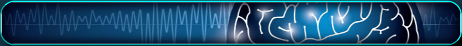
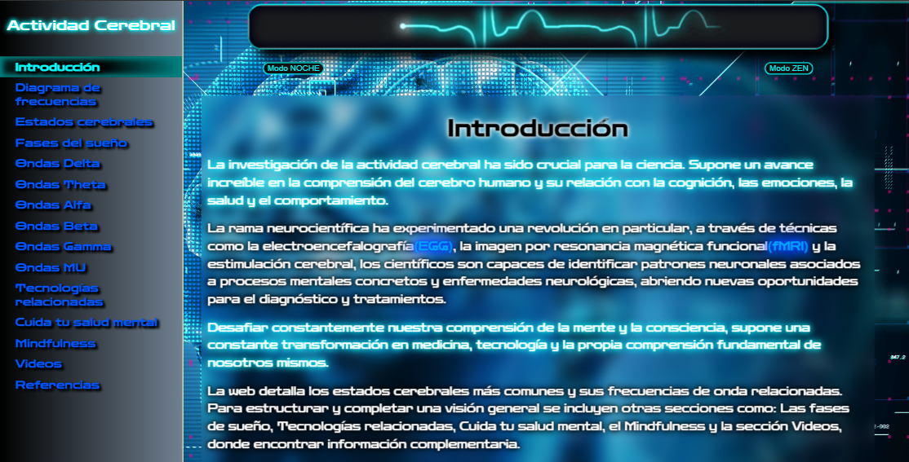

# 🖋 Documentación Técnica 📋

🚀 Gran trabajo de investigación científica oficial (fuentes en el pie de página/footer). Acompañado por una sección de videos, buenas prácticas y consejos sobre cuidar la salud y el bienestar. Completa con prácticas de relajación y mindfulness.

Consta de una barra de navegación lateral (navbar) desde donde se accede a todo el contenido.
📲 Formato móvil disponible (responsive), el navbar se reduce y fija en el top. Todo el contenido (texto, imágenes, títulos, enlaces, videos, etc) se adaptan automáticamente al nuevo formato.

✒️ El estilo neón luminoso del texto me gusta mucho(pero tengo que refinarlo), y no es novedoso, resulta que las webs tienen el concepto de 'moda' muy marcado, las tendencias hacen que los estilos se generalicen. Tocará estudiar diseños modernos, aunque las modas siempre vuelven, dicen, y continuamente veo efectos neón en muchas webs, sobre todo las que tienen que ver con el desarrollo.

💯 En cualquier caso hay una buena estructura construida con un adaptado total `diseño responsivo`, para adaptar el basto contenido a cualquier tipo de _**móvil, tableta o pantalla**_. 

▶️ Los videos de youtube incrustrados también se adaptan al view port, con un tamaño máximo.

Al último momento decidí implementar 2 botones para cambiar el estilo, e introducir algo de interactividad javaScript. Las animaciones quedan bien.

Pero haré mas cambios en un futuro.

Gracias por la visita, ya que has leído hasta aquí, te diré que hay un lugar oculto (LINK EN PALABRA RELACIONADA), donde podrás ver al youtuber español más grande (en todos los sentidos😂) del mundo!
Un video participando en una Sesión Grupal de Hipnósis muuy divertida.

 

<!---->

# 👉 [BrainActivity](https://conancos.dev/brainactivity)

 

